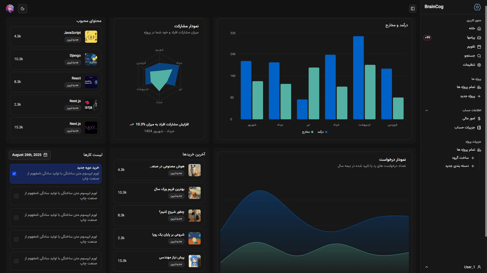

# Dashboard Project



[**Live Demo**](https://dashboard-1x49-45dyko4ry-javads-projects-343b57b5.vercel.app/)

---

## 📖 Project Overview

A modern **admin dashboard** built with **Next.js** and **TypeScript**, designed for real-time analytics and data visualization.

### ✅ Key Features

-   📊 Interactive charts and data visualizations
-   📱 Responsive design for all devices
-   🌙 Dark/Light theme toggle
-   🌍 RTL language support
-   👤 User management interface
-   💳 Payment tracking system

---

## 🚀 Live Preview

👉 [Click here to view the live demo](https://dashboard-1x49-45dyko4ry-javads-projects-343b57b5.vercel.app/)

---

## 🛠 Installation & Setup

Clone the repository:

```bash
git clone <repository-url>
cd dashboard
```

Install dependencies:

```bash
npm install
# or
yarn install
# or
pnpm install
```

Run development server:

```bash
npm run dev
```

Open [http://localhost:3000](http://localhost:3000) in your browser.

---

## 📦 Build for Production

```bash
npm run build
npm run start
```

---

## 🗂 Tech Stack

-   [Next.js](https://nextjs.org/) – React framework
-   [TypeScript](https://www.typescriptlang.org/) – Static typing
-   [Tailwind CSS](https://tailwindcss.com/) – Utility-first CSS
-   [shadcn/ui](https://ui.shadcn.com/) – UI components
-   [Radix UI](https://www.radix-ui.com/) – Accessible UI primitives
-   [Recharts](https://recharts.org/) – Charting library

---

## 🤝 Contributing

1. **Fork** the repository
2. Create a **feature branch**
3. Commit with clear messages
4. Open a **pull request**

---

## 🐛 Issues & Support

-   Check **existing issues** before creating a new one
-   Open a **new issue** with a clear description and screenshots
-   For Next.js help: [Next.js Docs](https://nextjs.org/docs)

---
